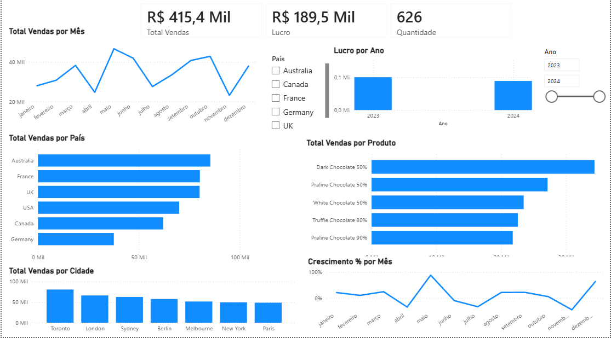

#  Análise de Vendas - Chocolate Sales

##  Objetivo
Analisar o desempenho de vendas de chocolates entre 2023 e 2024, identificando padrões e oportunidades de negócio.

##  Ferramentas utilizadas
- Power BI
- Power Query
- DAX

##  Análises realizadas
- Vendas por mês
- Lucro por ano
- Ranking de produtos
- Crescimento percentual
- Vendas por país e cidade

##  Principais insights
- A Austrália lidera o faturamento, indicando forte presença nesse mercado.
- O produto mais vendido é o Dark Chocolate 50%.
- Houve queda significativa nas vendas em novembro.
- O crescimento mensal apresenta variações ao longo do período.

##  Dashboard

Visão geral do dashboard desenvolvido:

